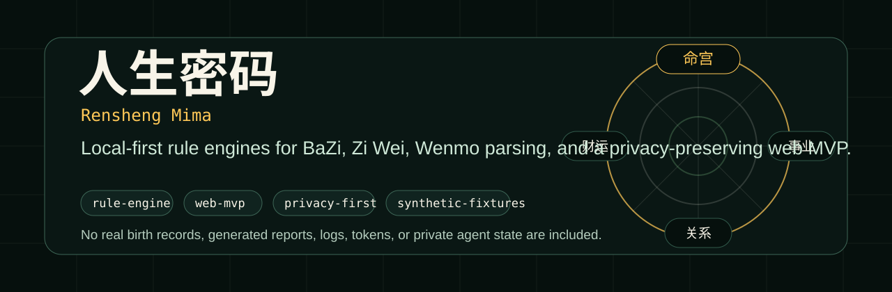
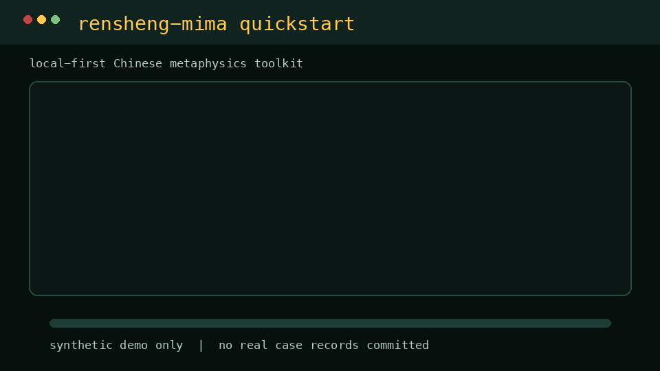
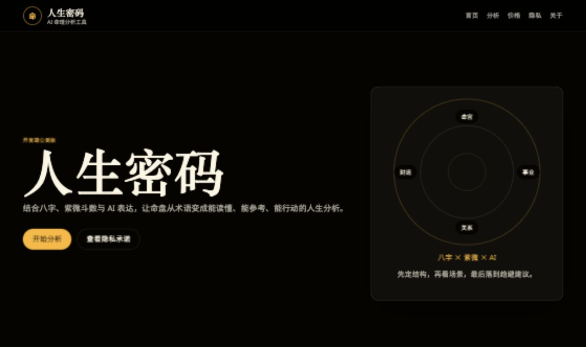
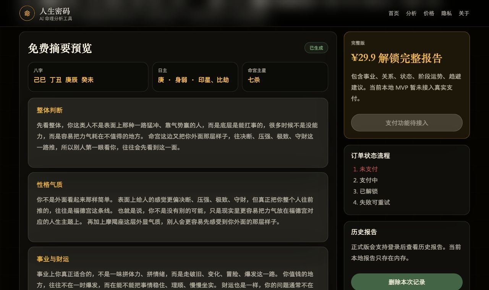
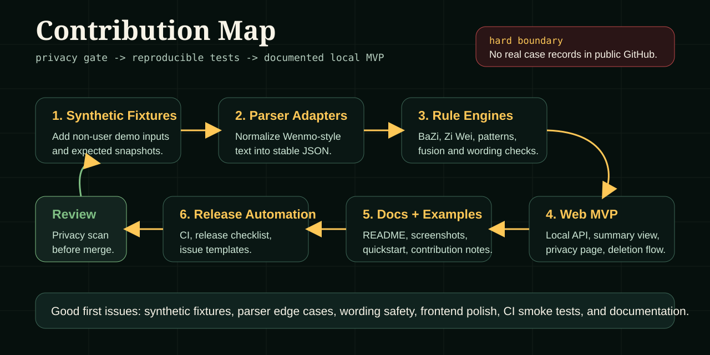

# 人生密码 / Rensheng Mima

<p align="center">
  
</p>

<p align="center">
  <a href="https://github.com/rucmeteor1025/rensheng-mima/actions/workflows/ci.yml"></a>
  <a href="https://github.com/rucmeteor1025/rensheng-mima/releases"></a>
  <a href="LICENSE"></a>
  <a href="PRIVACY.md"></a>
  <a href="https://rucmeteor1025.github.io/rensheng-mima/"></a>
  
  
</p>

Local-first Chinese metaphysics computation toolkit and web MVP.

人生密码是一个本地优先的中文命理结构化计算工具。它把八字、紫微斗数、文墨天机兼容文字盘解析、格局识别和融合报告拆成可测试的工程模块，并提供一个 React/Vite 与静态降级并存的本地网页入口。

> This project is for cultural research, structured rule-engine experiments, and personal reflection. It is not medical, legal, financial, or psychological advice.

Live static demo: <https://rucmeteor1025.github.io/rensheng-mima/>

The GitHub Pages demo is a privacy-safe static frontend. It uses synthetic fallback summaries because GitHub Pages cannot run the Python rule engine. For real local computation, run `python3 web/server.py`.

## 项目亮点

- **可测试的规则引擎**：八字、紫微斗数、格局检测、融合层和文墨兼容解析分别沉淀为可回归测试模块。
- **本地优先隐私模型**：公开仓库不包含真实出生记录、姓名、生成报告、日志、token 或 agent state。
- **可运行 Web MVP**：本地 API + 首页表单 + 免费摘要 + 价格页 + 隐私页 + 报告删除流程。
- **开源协作友好**：CI、issue template、release checklist、贡献指南、隐私扫描脚本和路线图都已放在仓库内。

## 快速上手

<p align="center">
  
</p>

```bash
python3 -m venv .venv
source .venv/bin/activate
pip install -r requirements.txt
python3 scripts/xiashensuan.py 1990 1 15 14 --minute 30 --gender 男 --place 北京 --mode life
```

Run the local web MVP:

```bash
python3 web/server.py
```

Open `http://127.0.0.1:8765`.

Run the frontend dev server:

```bash
cd web/frontend
npm ci
npm run dev
```

## 产品预览

All screenshots below use synthetic/default demo input only.

| Home | Analysis |
| --- | --- |
|  |  |

## 能力范围

- BaZi engine with true-solar-time correction, ten-god analysis, weighted five-elements scoring, day-master strength, useful-god strategy, and luck-cycle summaries.
- Zi Wei Dou Shu engine using a C5FYC-style rule path, palace maps, major stars, support stars, transformations, and boundary-sensitive double-chart handling.
- Wenmo-compatible text parser for private local regression workflows.
- Pattern detectors for Zi Wei chart structures.
- Fusion layer for BaZi, Zi Wei, MBTI, zodiac, and blood-type modules.
- Local web MVP with free summary, mock checkout flow, privacy page, pricing page, and report deletion.

## 隐私边界

No real user birth records, names, generated reports, private notes, logs, tokens, or agent state are included in this public package.

The public `xiashensuan_core/fixtures/wenmo_cases/manifest.json` is intentionally empty. Maintainers can keep private fixture records locally under `private_records/`, which is ignored by Git.

Before publishing or merging a contribution, run the privacy scan and tests:

```bash
python3 -B scripts/wenmo_text_scan.py --record-dir private_records
```

## 前端开发

```bash
cd web/frontend
npm ci
npm run build
```

After building, restart `python3 web/server.py`; the server will serve `web/frontend/dist/` first and fall back to `web/static/` if no build exists.

## 测试

```bash
python3 -B scripts/ziweiwenmotests.py
python3 -B scripts/xiashensuantests.py
python3 -B scripts/ziwei_patterns_tests.py
python3 -B scripts/wenmo_text_scan.py --record-dir private_records
```

Private Wenmo fixture tests are skipped when no private fixtures exist.

## 贡献路线



Good first contribution areas:

- add synthetic public fixtures that do not come from real users
- improve parser edge-case coverage
- split output schemas into typed JSON contracts
- polish the local web MVP and frontend smoke tests
- expand privacy review checks for pull requests
- improve examples, screenshots, and docs

Open work is tracked in [GitHub Issues](https://github.com/rucmeteor1025/rensheng-mima/issues). Please read [CONTRIBUTING.md](CONTRIBUTING.md), [PRIVACY.md](PRIVACY.md), and [SECURITY.md](SECURITY.md) before submitting changes.

## Repository Scope

Included:

- rule engines
- local web MVP source
- deterministic tests
- privacy and contribution docs
- synthetic screenshots and quickstart demo assets

Excluded:

- real case records
- generated reports
- private notes
- private agent files
- `.openclaw` or local runtime state
- `node_modules`
- frontend build artifacts

## Roadmap

- Add synthetic public fixtures that do not come from real users.
- Split the engine into a proper Python package.
- Add typed JSON schema for chart outputs.
- Add GitHub Pages demo screenshots or static preview.
- Add CI coverage for backend smoke tests and frontend preview checks.
- Add privacy review checklist for contribution review.

## License

MIT.
